# 📊 Diagramas do Sistema - ANSTARTUP Brasil

## 🏗️ Arquitetura Geral do Sistema

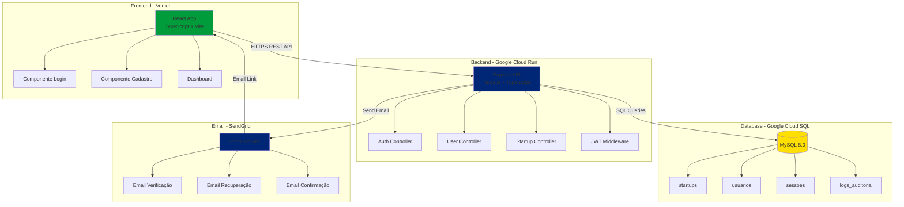

---

## 🔐 Fluxo de Autenticação (Login)

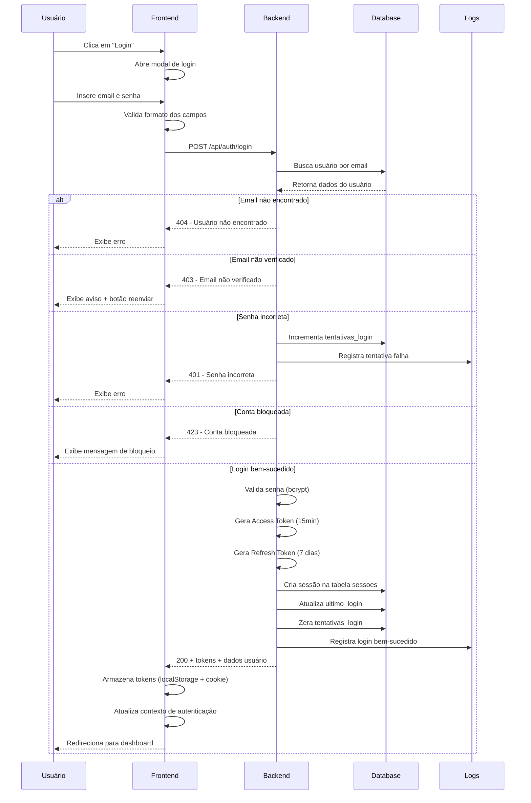

---

## 📝 Fluxo de Cadastro (5 Etapas)

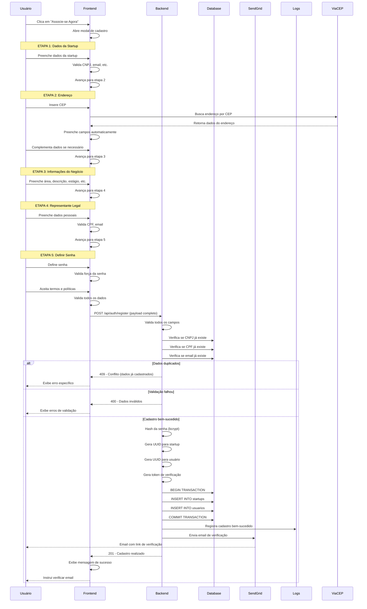

---

## 🔄 Fluxo de Recuperação de Senha

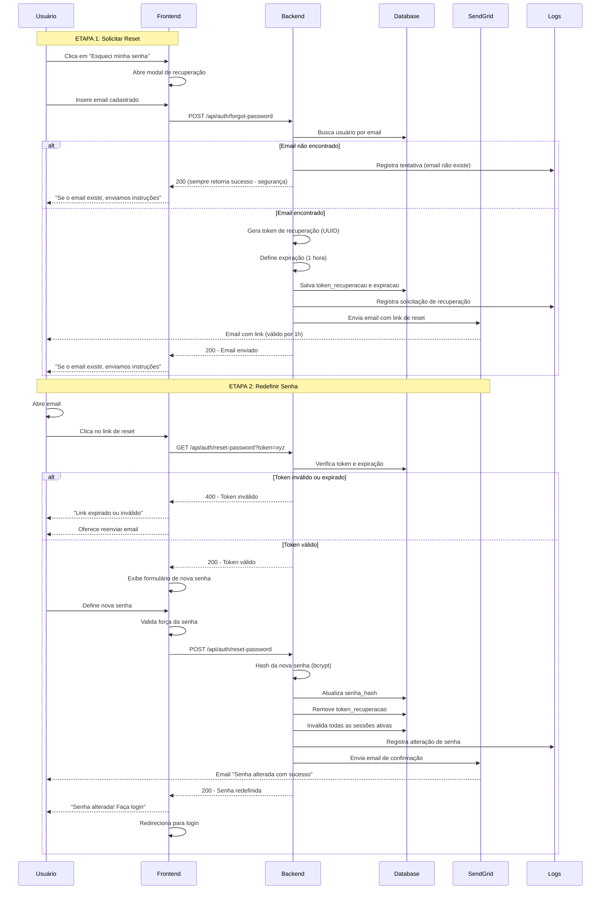

---

## ✉️ Fluxo de Verificação de Email

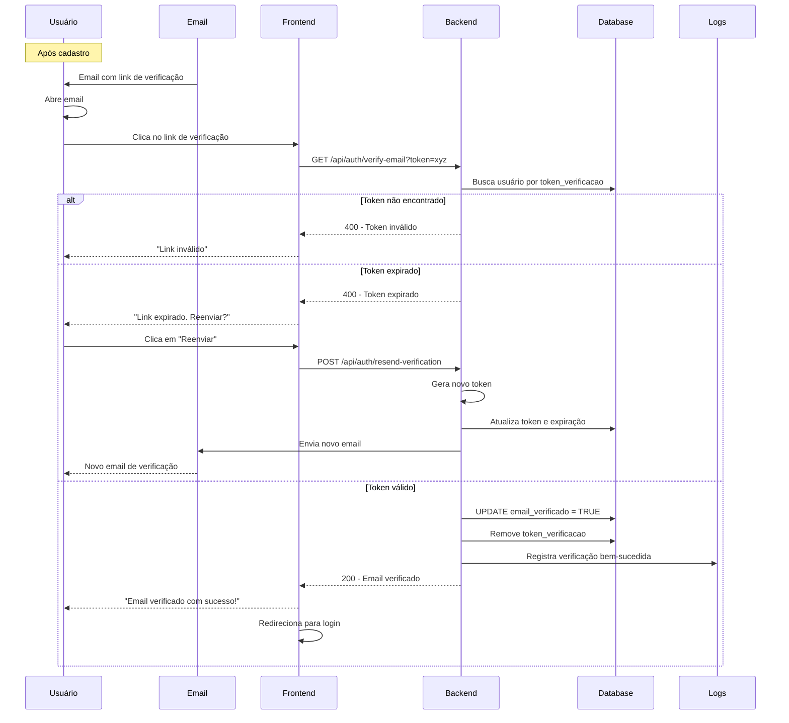

---

## 🔒 Modelo de Dados (ER Diagram)

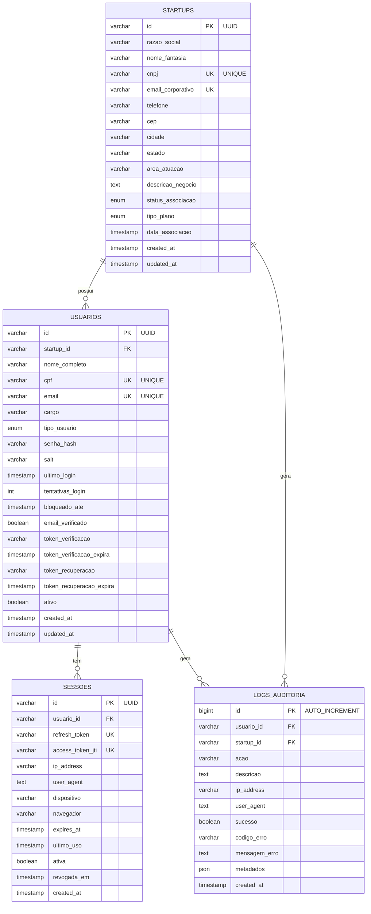

---

## 🎨 Fluxo de Navegação do Usuário

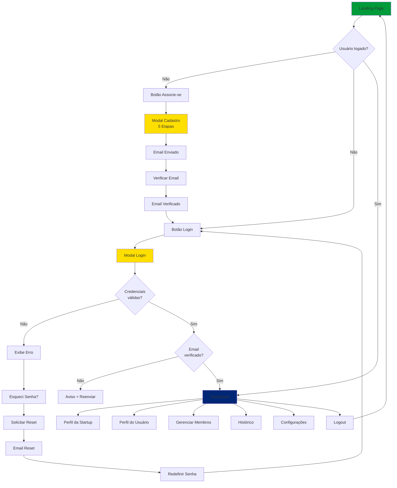

---

## 📈 Estados de uma Startup no Sistema

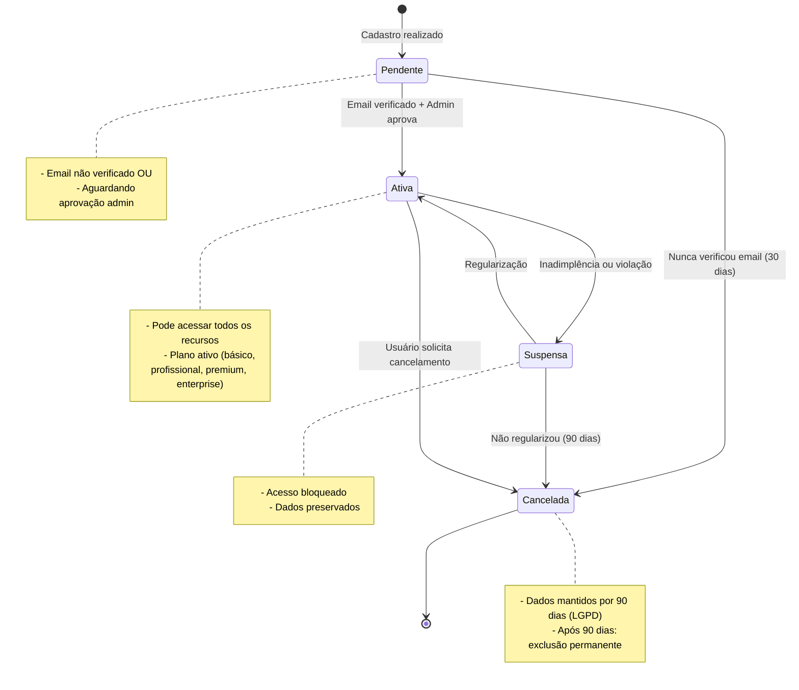

---

## 🔐 Ciclo de Vida de um Token JWT

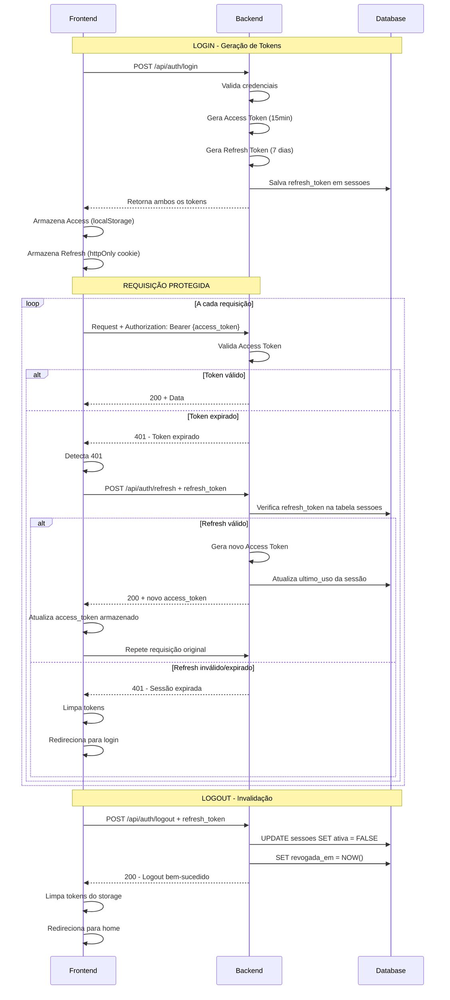

---

## 🛡️ Camadas de Segurança

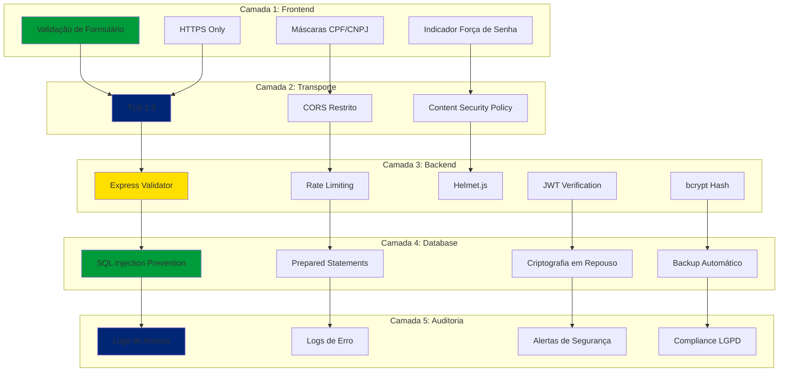

---

## 📱 Responsividade e Dispositivos

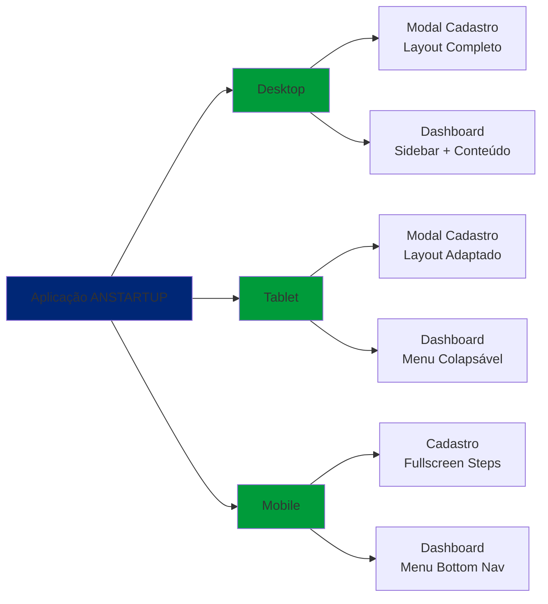

---

*Diagramas criados em: 25 de outubro de 2025*
*Formato: Mermaid (renderizável no GitHub, VSCode, etc.)*
